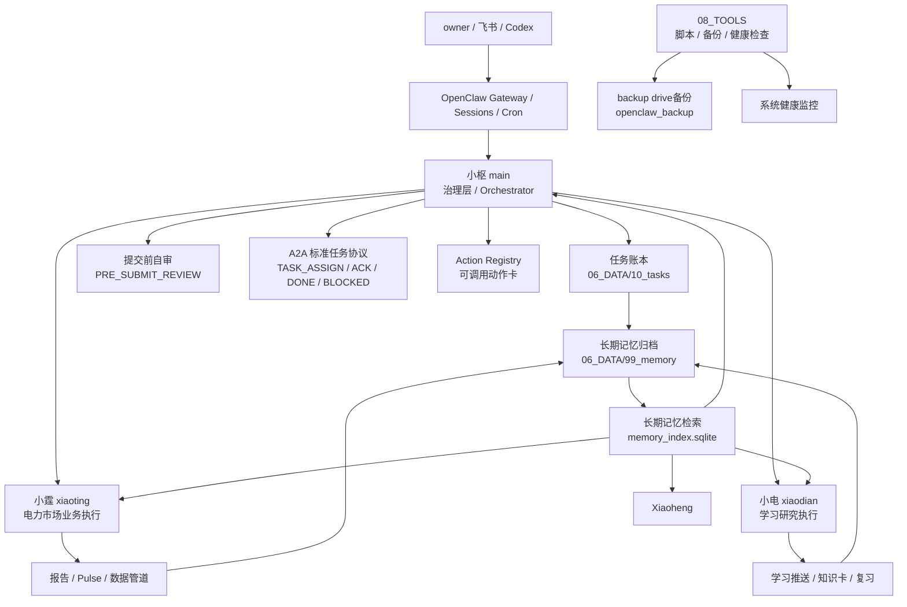

# AI_SYSTEM 架构设计 v1.1

版本：v1.1  
状态：active  
最后更新：2026-05-20  
维护者：小枢  

## 1. 定位

`AI_SYSTEM` 是 owner 的个人 AI 组织系统。它不是单个聊天助手，而是一套由治理层、执行层和基础设施层组成的长期运行系统，用于支持：

- 电力市场业务分析和报告生产
- 电力市场与 AI 产品学习
- 健康、训练、饮食、睡眠和皮肤趋势管理
- 长期记忆、知识沉淀、任务追踪和自动化运维
- 飞书 / OpenClaw / 本地工具之间的协同

v1.1 的核心目标是：**不增加新 Agent，在现有多个 Agent 上补齐自审、任务账本、A2A 协议、Action 注册、记忆检索和复盘闭环。**

## 2. 总体架构



## 3. 三层结构

### 3.1 治理层：小枢

小枢是默认入口和治理层，不直接替代执行 Agent 长期做专业工作。

小枢负责：

- 判断任务归属
- 拆解跨 Agent 任务
- 维护 Agent 边界
- 维护 Prompt / Memory / Data / Output 规则
- 管理 Skill / Action 生命周期
- 管理任务账本、A2A 协作和复盘
- 维护记忆归档、健康检查、备份和 cron
- 做低风险系统修复和状态汇报

核心文件：

| 文件 | 作用 |
|---|---|
| `AGENTS.md` | 全局运行规则 |
| `MEMORY.md` | 小枢当前加载摘要 |
| `MEMORY/STATE.md` | 小枢长期系统状态 |
| `00_GOVERNANCE/TASK_ROUTING_RULES.md` | 任务分流规则 |
| `00_GOVERNANCE/PRE_SUBMIT_REVIEW.md` | 提交前轻量自审 |
| `00_GOVERNANCE/AGENT_MSG_SPEC.md` | A2A 标准任务协议 |
| `00_GOVERNANCE/ACTION_REGISTRY.md` | 可调用动作注册表 |
| `00_GOVERNANCE/TASK_LEDGER_REVIEW.md` | 周/月任务复盘规则 |

### 3.3 基础设施层

基础设施层支撑各个 Agent 长期运行。

| 模块 | 路径 | 作用 |
|---|---|---|
| 治理文档 | `00_GOVERNANCE/` | 架构、规则、注册、路由、协议 |
| 共享知识 | `04_SHARED_KNOWLEDGE/` | 跨 Agent 共享资料 |
| 共享技能 | `05_SHARED_SKILLS/` | 可复用 Skill |
| 数据层 | `06_DATA/` | 注册表、任务账本、健康数据、记忆归档 |
| 输出归档 | `07_OUTPUTS/` | 报告、笔记、结构化输出 |
| 工具层 | `08_TOOLS/` | 备份、健康检查、任务账本、记忆索引等脚本 |
| OpenClaw 配置 | `openclaw-data/config/` | agent、cron、会话、飞书入口配置 |
| 备份 | `<backup_mount>/` | 每日增量、每周快照 |

## 4. v1.1 新增治理协议

### 4.1 提交前轻量自审

不新增审稿 Agent。各个 Agent 在正式提交前自行执行轻量自审。

适用场景：

- 日报 / 周报 / Pulse
- 学习推送
- 健康建议
- 系统改动
- A2A 回报
- 飞书外发

规则文件：`00_GOVERNANCE/PRE_SUBMIT_REVIEW.md`

统一检查项：

- 日期是否正确
- 来源是否真实
- 是否越过职责边界
- 是否涉及高风险操作
- 输出是否符合格式
- 是否需要回报
- 是否需要写入记忆或任务账本

### 4.2 任务账本

任务账本用于追踪跨日、跨 Agent、cron 失败、系统建设和阻塞任务。

位置：

- SQLite：`06_DATA/10_tasks/task_ledger.sqlite`
- Markdown 看板：`06_DATA/10_tasks/TASK_BOARD.md`
- 周/月复盘：`06_DATA/10_tasks/reviews/`

工具：

```bash
python3 08_TOOLS/task_ledger.py add --title "任务标题" --owner xiaoshu --source user
python3 08_TOOLS/task_ledger.py update TASK-YYYYMMDD-001 --status done --output "结果路径" --reported
python3 08_TOOLS/task_ledger.py list
python3 08_TOOLS/task_ledger.py report
```

状态：

- `open`
- `doing`
- `blocked`
- `done`
- `canceled`

### 4.3 A2A 标准任务协议

跨 Agent 执行任务必须绑定任务账本，并使用标准消息类型。

规则文件：`00_GOVERNANCE/AGENT_MSG_SPEC.md`

标准类型：

| 类型 | 用途 |
|---|---|
| `TASK_ASSIGN` | 分派任务 |
| `TASK_ACK` | 接收方确认收到 |
| `TASK_DONE` | 完成并返回结果 |
| `TASK_BLOCKED` | 阻塞并说明原因 |

生成模板：

```bash
python3 08_TOOLS/task_ledger.py a2a-template TASK-YYYYMMDD-001 --to xiaoting
```

### 4.4 Action 注册表

Skill 说明“会做什么”，Action 说明“怎么调用”。

规则文件：`00_GOVERNANCE/ACTION_REGISTRY.md`

每个 Action 记录：

- `action_id`
- owner agent
- trigger
- inputs
- outputs
- command or prompt
- permissions
- failure mode
- review required
- ledger rule
- memory rule

v1.1 已登记的高频 Action：

- `xiaoshu.memory.archive`
- `xiaoshu.memory.reflect`
- `xiaoshu.memory.index`
- `xiaoshu.health.monitor`
- `xiaoshu.backup.daily`
- `xiaoshu.task.ledger`
- `xiaoting.daily.report`
- `xiaoting.pulse.policy`
- `xiaoting.pulse.market_signal`
- `xiaodian.daily.learning_push`

## 5. 记忆体系

### 5.1 记忆分层

```text
短期上下文
  └─ 当前会话

启动记忆
  ├─ MEMORY.md
  └─ MEMORY/STATE.md

每日压缩记忆
  └─ 06_DATA/99_memory/daily/{agent}/YYYY-MM-DD.md

反思与洞察
  ├─ 06_DATA/99_memory/reflections/
  └─ 06_DATA/99_memory/insights/

长期检索索引
  └─ 06_DATA/99_memory/memory_index.sqlite
```

### 5.2 记忆检索

工具：`08_TOOLS/memory_semantic_index.py`

当前模式：

- 默认 SQLite + 本地哈希向量
- 不依赖 Ollama
- ChromaDB 可选增强

命令：

```bash
python3 08_TOOLS/memory_semantic_index.py index
python3 08_TOOLS/memory_semantic_index.py status
python3 08_TOOLS/memory_semantic_index.py search "关键词" -n 5
```

使用规则：

- 涉及历史问题、旧聊天、用户偏好、旧产出、跨日连续任务时，先检索长期记忆。
- 检索结果只作为线索，关键事实仍需打开源文件核对。

## 6. 自动化运行链路

### 6.1 夜间记忆链路

每日凌晨按北京时间执行：

| 时间 | 任务 | 作用 |
|---|---|---|
| 02:34 | Daily 占位 | 补齐昨日多个 Agent daily 记录 |
| 02:40 | 记忆归档压缩 | 压缩到 `06_DATA/99_memory/daily/` |
| 02:45 | 夜间记忆反思 | 生成 reflections 和 insights |
| 02:47 | 长期记忆索引 | 刷新 `memory_index.sqlite` |
| 02:50 | 小枢日报 | 读取归档和反思后推送 |
| 03:00 | 系统健康监控 | 检查数据库、cron、备份、记忆、任务账本和关键坏链接；刷新 `SYSTEM_DASHBOARD.md`；warning/error 自动建账 |

### 6.2 任务复盘链路

| 时间 | 任务 | 输出 |
|---|---|---|
| 每周一 03:10 | 任务账本周复盘 | `06_DATA/10_tasks/reviews/weekly_*.md` |
| 每月 1 日 03:20 | 任务账本月复盘 | `06_DATA/10_tasks/reviews/monthly_*.md` |

### 6.3 备份链路

备份目标：`<backup_mount>/`

每日增量备份包含：

- 治理文档
- 多个 Agent 核心配置
- Prompt / Skill / Memory
- 数据库
- 任务账本
- 记忆归档和记忆索引
- 健康数据
- 工具脚本
- cron 配置

`node_modules`、`__pycache__`、`.pyc` 不进入日备。

## 7. 主要数据与数据库

| 数据 | 路径 | 说明 |
|---|---|---|
| 任务账本 | `06_DATA/10_tasks/task_ledger.sqlite` | 任务状态与事件 |
| 长期记忆索引 | `06_DATA/99_memory/memory_index.sqlite` | 跨 Agent 记忆检索 |
| 小电学习库 | `03_XIAODIAN/RUNTIME/power_market_learning_agent/knowledge_base/learning.sqlite` | 学习固化与复习 |
| 小霆业务知识库 | `02_XIAOTING/POWER_MARKET_AGENT/knowledge_base/knowledge_base.db` | 电力市场资料与数据 |

## 8. 安全边界

全局禁止：

- 不自动交易
- 不泄露密钥
- 不编造政策、电价、规则或数据
- 不未经确认删除、覆盖或大规模移动重要数据
- C 盘只读和复制，不删除、不覆盖、不移动、不清理

高风险操作必须：

1. 说明影响范围
2. 保留备份或回滚方式
3. 走提交前自审
4. 必要时写入任务账本

## 9. 当前运行事实

截至 2026-05-20：

- 小枢是默认治理入口。
- 记忆机制已完成基础闭环。
- 长期记忆检索已上线，当前不依赖 Ollama。
- 任务账本、自审、A2A 标准协议、Action 注册表已上线。
- backup drive备份恢复，日备包含任务账本、记忆索引、工具脚本和 cron 配置。
- 健康检查已覆盖数据库、cron、备份、记忆归档、记忆检索、任务账本、关键坏链接和残余会话，并会刷新系统看板。
- `health_monitor.py` 发现 warning/error 时会按健康分区自动写入任务账本，使用 `health_monitor:{section}` 防重复。
- 小霆电价数据采集仍处于暂停状态。

## 10. v1.1 不做什么

v1.1 明确不做：

- 不新增审稿 Agent。
- 不引入大型外部 Agent 框架。
- 不强依赖 Ollama / ChromaDB。
- 不把所有任务都自动化执行。
- 不把任务账本和周/月复盘做成两套重复系统。

## 11. 后续演进方向

优先级从高到低：

1. 继续观察任务账本是否真的降低遗忘和阻塞。
2. 给高频 Action 补更完整的输入/输出/失败处理。
4. 让健康监控中的异常自动建账。
5. 建立“过期记忆/冲突记忆”标记机制。
6. 视需要升级更强语义检索，但不作为当前前置条件。

## 12. 版本历史

| 版本 | 日期 | 说明 |
|---|---|---|
| v1.1 | 2026-05-20 | 正式确立三层架构 + 多个 Agent + 自审 + 任务账本 + A2A + Action + 记忆检索 + 复盘闭环 |
